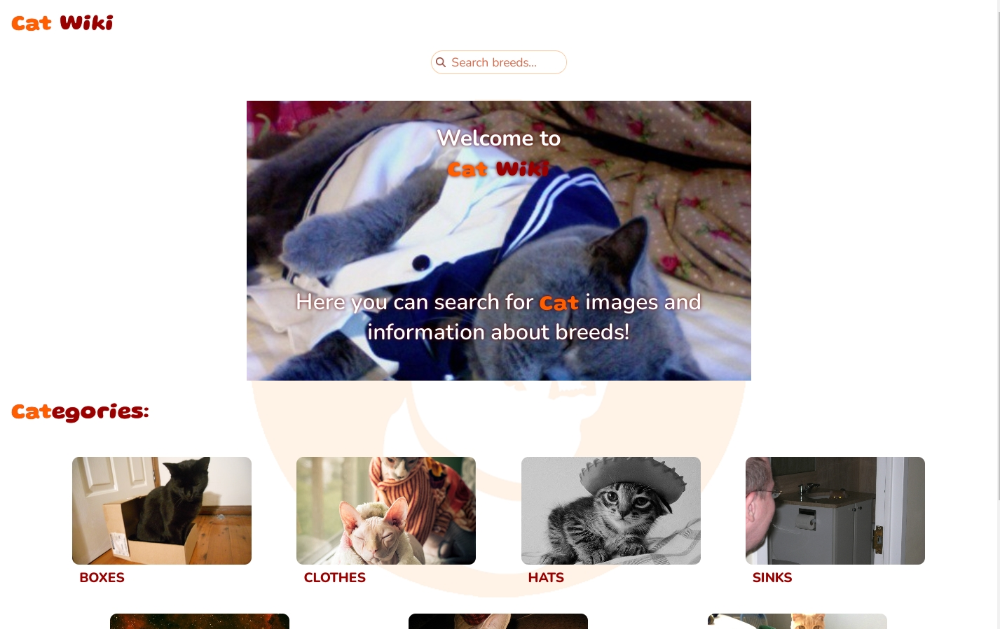
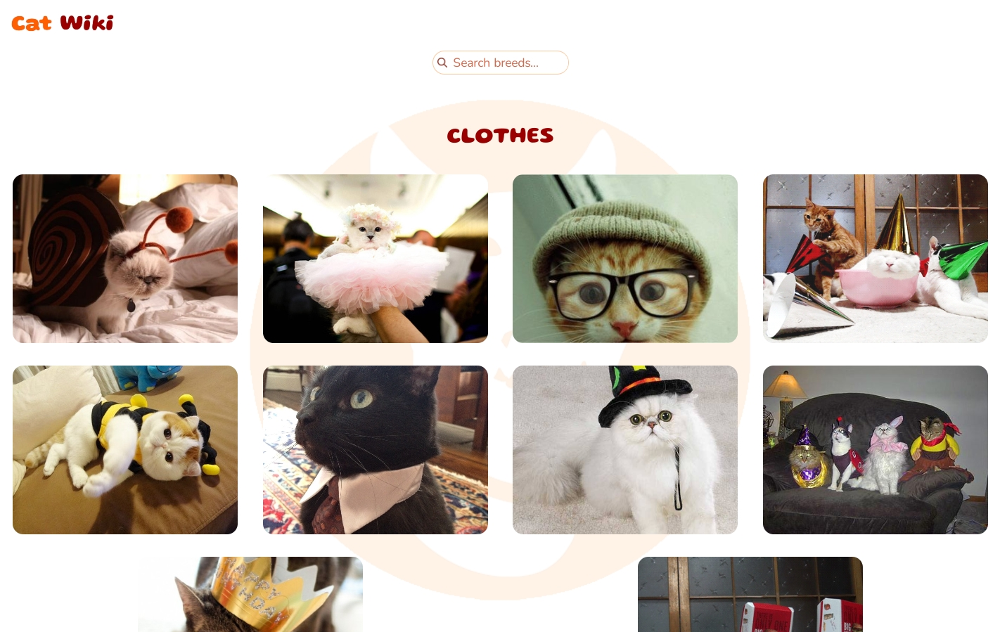
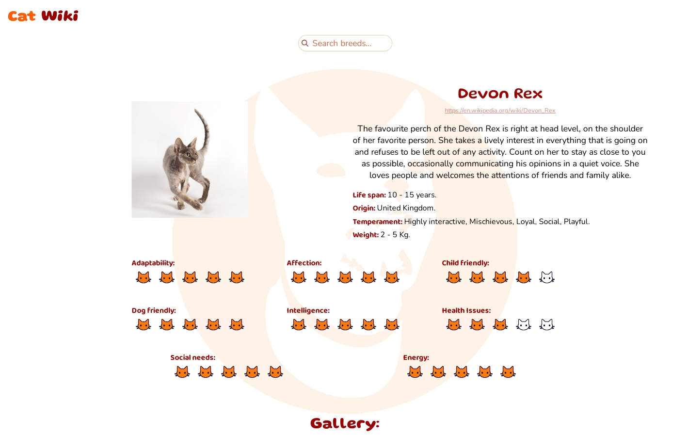

# Introducción

Resumen e instalación del proyecto. Esta app te permite ver imagenes de gatos, buscar imagenes por categorías y buscar información sobre las distintas razas.

## Características

- Búsqueda de información e imagenes por raza
- Búsqueda de imagenes por categoría

## Tecnologías

- React
- Redux Toolkit 
- Typescript
- Express

# Instalación del proyecto

## Clonar el repositorio

```bash
    git clone https://github.com/asgonzales/catwiki
```

## Dentro de la carpeta api crear un archivo .env con los siguientes valores

    APIKEY=<<api obtenida de thecatapi.com>>
    API_PORT=3001
    CORS=http://localhost:3000

## Ejecutar los siguientes comandos

```bash
    npm install
    npm run dev
```


## Dentro de la carpeta client crear un archivo .env con los siguientes valores

    REACT_APP_BASE_URL=http://localhost:3001

## Ejecutar los siguiente comandos

```bash
    npm install
    npm start
```


### Luego se podrá ver el proyecto ejecutándose en localhost:3000

## Screenshots






